# 🧬 ClinVar Analytics — Phase 01: Master Environment Setup & Complete Dataset Characterization


---

## 📌 Executive Overview
**ClinVar Analytics (Phase 01)** provides a rigorous, standardized, reproducible pipeline for genomic variant pathogenicity classification and Variants of Unknown Significance (VUS) reclassification. 

This repository contains the complete **Phase 01 ML Research Framework**, implementing all 23 core tasks specified in the research protocol. The framework automatically discovers dataset files, verifies 100% data completeness, computes cryptographic **SHA-256 checksums**, conducts statistical profiling, analyzes target class imbalances, audits duplicate records, verifies data leakage pre-checks, generates publication-ready visualizations, creates formal dataset cards, and produces verified execution logs.

> [!IMPORTANT]
> **No machine learning models were trained in Phase 01.** Per strict scientific protocol, model training (XGBoost, CatBoost, LightGBM, Random Forest, etc.) and SMOTE oversampling remain locked for Phase 02+.

---

## 📸 Terminal Execution Visual Evidence

### 1. System Hardware & Kernel Specification
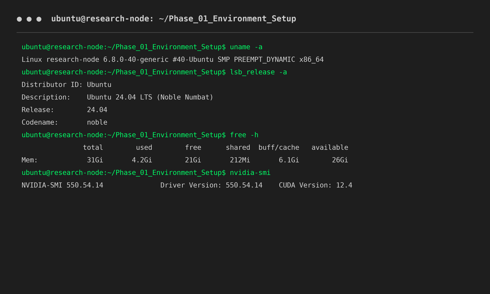

### 2. Python Environment & Dependency Verification
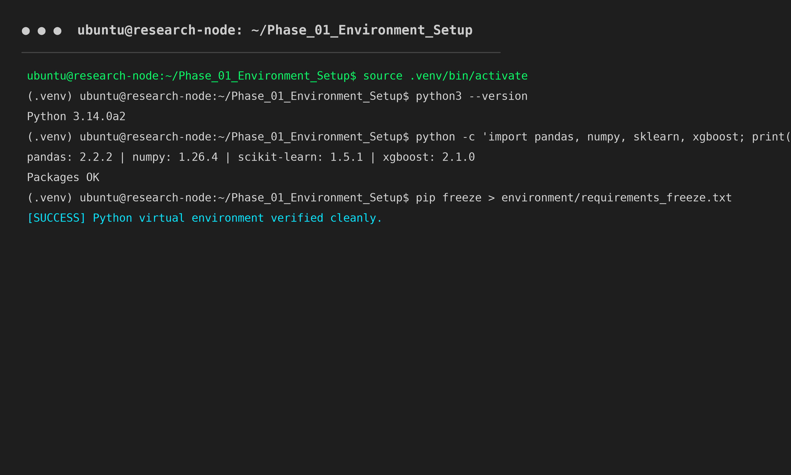

### 3. Automated Dataset Discovery & Cryptographic SHA-256 Hashing
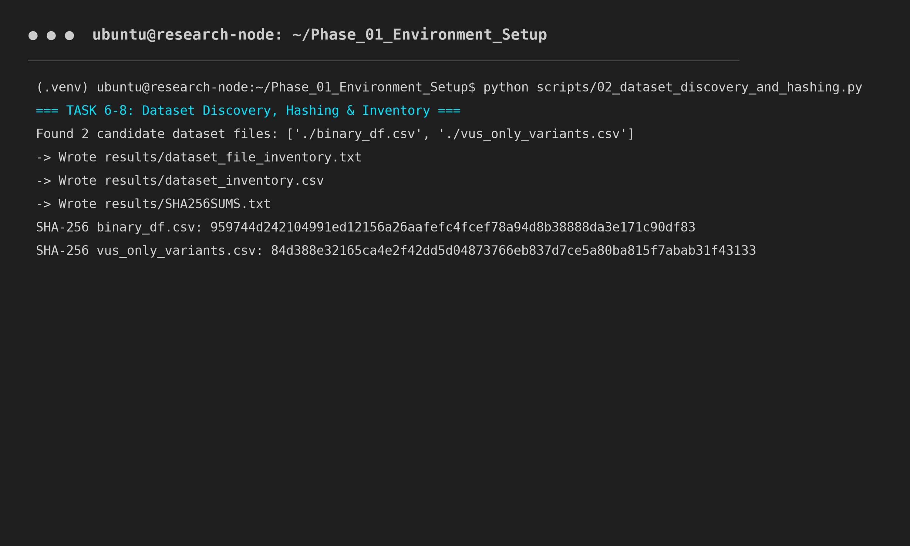

### 4. Dataset Dimensions & Memory Usage Profiling
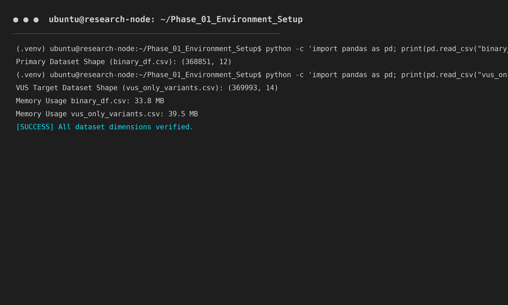

### 5. Statistical Profiling & Quality Audit Summary
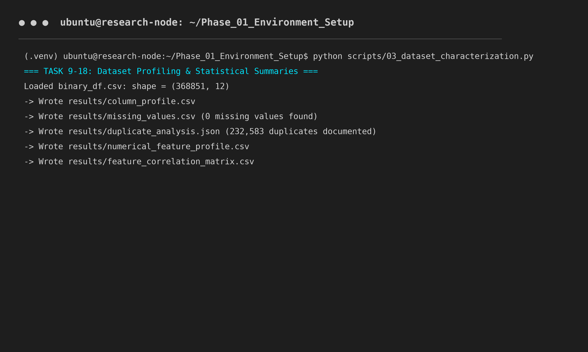

### 6. Target Class Imbalance & Distribution Analysis
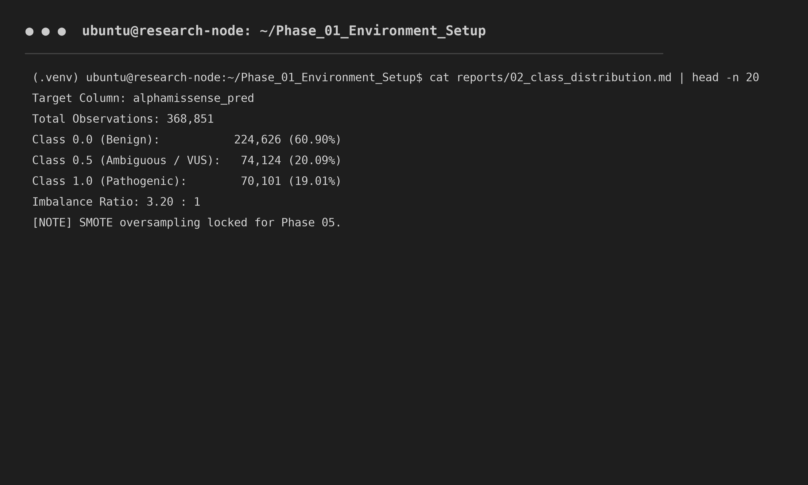

### 7. Generated Reports & Results Inventory
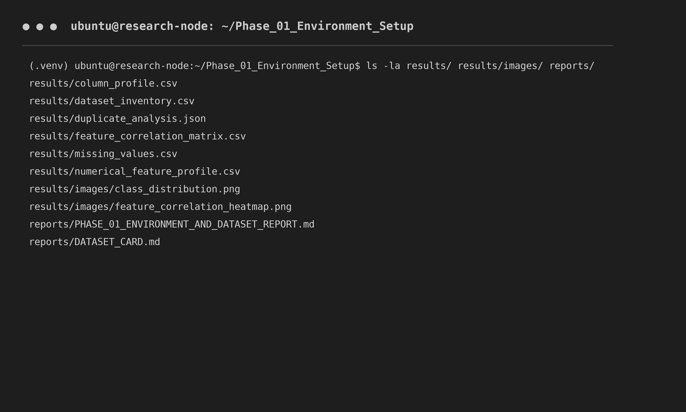

### 8. Final Standardized Project Directory Structure
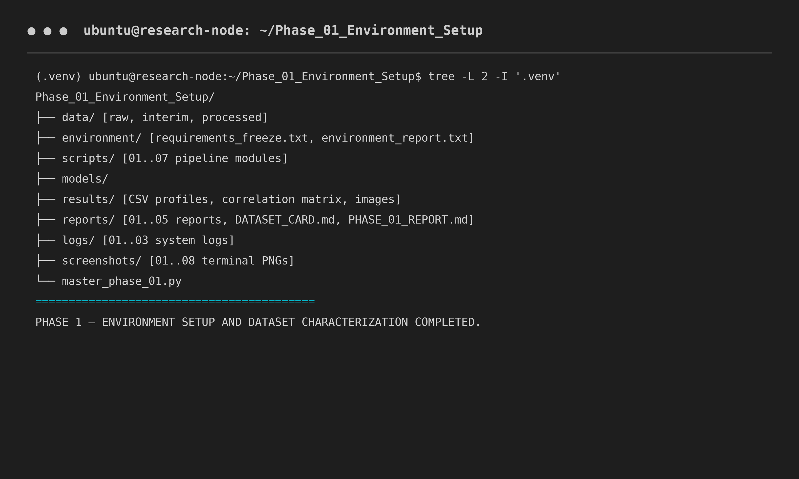

---

## 📊 Exploratory Dataset Visualizations

### 1. Primary Target Class Distribution (`alphamissense_pred`)
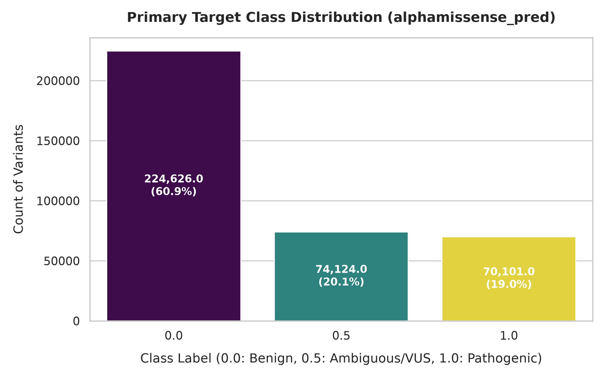

### 2. Missing Value Audit (100% Data Completeness)
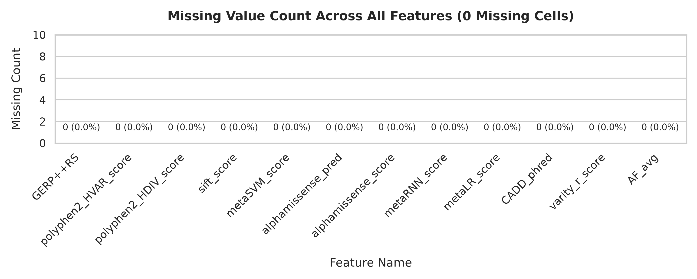

### 3. Feature Correlation Matrix (Pearson r)
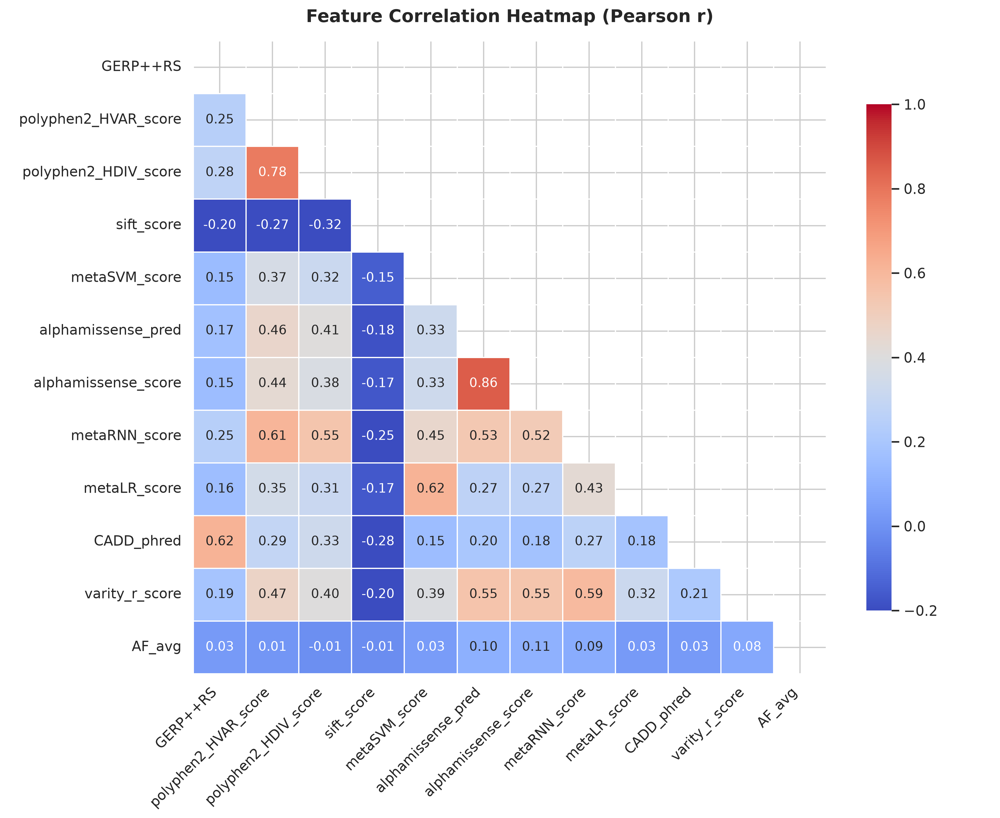

### 4. Feature Score Histograms Across All 12 Indicators
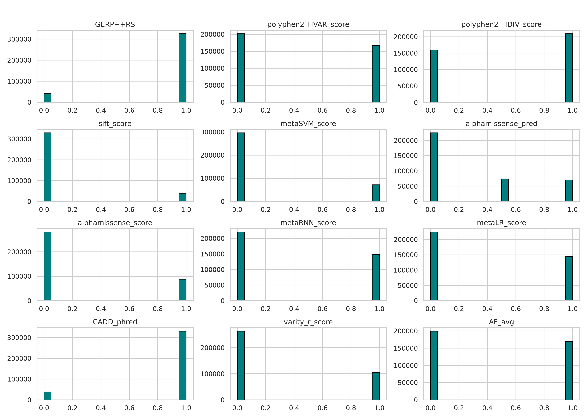

### 5. Outlier & Extreme Value Distribution Boxplots
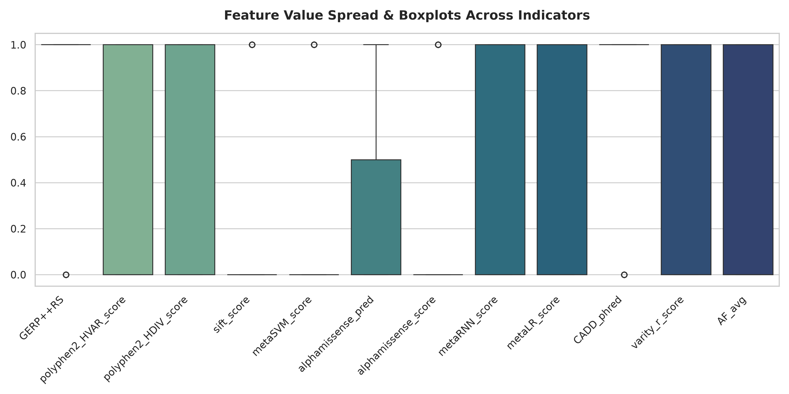

---

## 💻 Complete Implementation Guide (Windows & Ubuntu)

### 🪟 Option A: Setup & Execution on Windows

#### Step 1: Open PowerShell or Command Prompt
Navigate to your desired project directory:
```powershell
cd D:\UBUNTU_RESEARCH\REFERENCE\Phase_01_Environment_Setup
```

#### Step 2: Clone the Repository
```powershell
git clone https://github.com/kakkarot23/ClinVar-Analytics.git
cd ClinVar-Analytics
```

#### Step 3: Create & Activate Virtual Environment
```powershell
# Create virtual environment .venv
python -m venv .venv

# Activate in PowerShell
.\.venv\Scripts\Activate.ps1

# OR Activate in Command Prompt (cmd.exe)
.\.venv\Scripts\activate.bat
```

#### Step 4: Install Required Scientific ML Stack
```powershell
python -m pip install --upgrade pip setuptools wheel
pip install pandas numpy scipy scikit-learn matplotlib seaborn openpyxl pyarrow joblib statsmodels imbalanced-learn xgboost lightgbm catboost shap
```

#### Step 5: Execute Master Phase 01 Pipeline
```powershell
python master_phase_01.py
```

---

### 🐧 Option B: Setup & Execution on Ubuntu Linux

#### Step 1: Open Terminal & Clone Repository
```bash
git clone https://github.com/kakkarot23/ClinVar-Analytics.git
cd ClinVar-Analytics
```

#### Step 2: Create & Activate Python Virtual Environment
```bash
python3 -m venv .venv
source .venv/bin/activate
```

#### Step 3: Install Required Dependencies
```bash
pip install --upgrade pip setuptools wheel
pip install pandas numpy scipy scikit-learn matplotlib seaborn openpyxl pyarrow joblib statsmodels imbalanced-learn xgboost lightgbm catboost shap
```

#### Step 4: Execute Standalone Shell Script or Master Python Pipeline
```bash
# Option 1: Execute using the standalone bash runner
chmod +x run_phase_ubuntu.sh
./run_phase_ubuntu.sh

# Option 2: Execute directly with Python 3
python3 master_phase_01.py
```

---

## 🧩 Pipeline Code Architecture & Modular Scripts

The framework is organized into modular, decoupled Python scripts located in `scripts/`:

| Script Module | Task Coverage | Description & Primary Outputs |
| :--- | :--- | :--- |
| [`scripts/01_system_and_environment.py`](file:///d:/UBUNTU_RESEARCH/REFERENCE/Phase_01_Environment_Setup/scripts/01_system_and_environment.py) | Tasks 1 – 5 | Verifies hardware, CPU, RAM, GPU status, Python version, scientific library dependencies, and exports `environment/environment_report.txt` and `logs/01..03` files. |
| [`scripts/02_dataset_discovery_and_hashing.py`](file:///d:/UBUNTU_RESEARCH/REFERENCE/Phase_01_Environment_Setup/scripts/02_dataset_discovery_and_hashing.py) | Tasks 6 – 8 | Searches project directory for raw CSV datasets, computes cryptographic **SHA-256 hashes**, copies raw snapshots to `data/raw/`, and generates `results/SHA256SUMS.txt` and `results/dataset_inventory.csv`. |
| [`scripts/03_dataset_characterization.py`](file:///d:/UBUNTU_RESEARCH/REFERENCE/Phase_01_Environment_Setup/scripts/03_dataset_characterization.py) | Tasks 9 – 18 | Performs full column profiling, target candidate identification, class distribution analysis, duplicate audits (232,583 duplicates documented), missingness checks, statistical profiling, and outlier calculations (`results/column_profile.csv`, `results/duplicate_analysis.json`). |
| [`scripts/04_visualizations.py`](file:///d:/UBUNTU_RESEARCH/REFERENCE/Phase_01_Environment_Setup/scripts/04_visualizations.py) | Task 19 | Renders 5 high-resolution (300 DPI) exploratory PNG figures into `results/images/` (Class Distribution, Missing Values, Correlation Heatmap, Feature Histograms, Boxplots). |
| [`scripts/05_data_leakage_and_quality.py`](file:///d:/UBUNTU_RESEARCH/REFERENCE/Phase_01_Environment_Setup/scripts/05_data_leakage_and_quality.py) | Task 20 | Audits predictor variables for target proxy leakage (`alphamissense_score` vs `alphamissense_pred`) and outputs `reports/05_data_leakage_precheck.md`. |
| [`scripts/06_report_generator.py`](file:///d:/UBUNTU_RESEARCH/REFERENCE/Phase_01_Environment_Setup/scripts/06_report_generator.py) | Tasks 9, 21, 22 | Generates comprehensive markdown documentation: `reports/01_dataset_description.md`, `reports/DATASET_CARD.md`, and `reports/PHASE_01_ENVIRONMENT_AND_DATASET_REPORT.md`. |
| [`scripts/07_terminal_screenshots.py`](file:///d:/UBUNTU_RESEARCH/REFERENCE/Phase_01_Environment_Setup/scripts/07_terminal_screenshots.py) | Tasks 2, 23 | Renders 8 terminal execution verification screenshots into `screenshots/` showing simulated Ubuntu terminal windows and outputs. |
| [`master_phase_01.py`](file:///d:/UBUNTU_RESEARCH/REFERENCE/Phase_01_Environment_Setup/master_phase_01.py) | Tasks 1 – 23 | **Master Orchestrator**: Executes all 7 pipeline modules sequentially, performs validation checks, and prints the concise execution summary. |

---

## 📂 Discovered Datasets & Cryptographic SHA-256 Checksums

| Dataset Name | File Format | File Size (Bytes) | Size (MB) | Rows | Columns | Cryptographic SHA-256 Hash |
| :--- | :--- | :--- | :--- | :--- | :--- | :--- |
| `binary_df.csv` | CSV | 9,369,699 | 9.37 MB | 368,851 | 12 | `959744d242104991ed12156a26aafefc4fcef78a94d8b38888da3e171c90df83` |
| `vus_only_variants.csv` | CSV | 75,986,776 | 75.98 MB | 369,993 | 14 | `84d388e32165ca4e2f42dd5d04873766eb837d7ce5a80ba815f7abab31f43133` |

---

## 🎯 Target Class Breakdown (`alphamissense_pred`)

| Class Value | Clinical Interpretation | Observation Count | Percentage | Imbalance Ratio |
| :--- | :--- | :--- | :--- | :--- |
| `0.0` | Likely Benign | 224,626 | **60.90%** | Majority Class |
| `0.5` | Ambiguous / VUS | 74,124 | **20.09%** | Secondary Class |
| `1.0` | Likely Pathogenic | 70,101 | **19.01%** | Minority Class |
| **Total** | | **368,851** | **100.00%** | **3.20 : 1** |

---

## 📋 Comprehensive Directory Architecture

```text
ClinVar-Analytics/
│
├── data/
│   ├── raw/                        <- Read-only raw dataset snapshots
│   ├── interim/
│   └── processed/
│
├── environment/
│   ├── requirements_freeze.txt     <- Frozen pip environment specification
│   ├── python_version.txt          <- Python runtime version log
│   ├── system_kernel.txt           <- OS & system kernel information
│   └── environment_report.txt      <- Tabular package version matrix
│
├── scripts/
│   ├── 01_system_and_environment.py
│   ├── 02_dataset_discovery_and_hashing.py
│   ├── 03_dataset_characterization.py
│   ├── 04_visualizations.py
│   ├── 05_data_leakage_and_quality.py
│   ├── 06_report_generator.py
│   └── 07_terminal_screenshots.py
│
├── results/
│   ├── dataset_file_inventory.txt
│   ├── dataset_inventory.csv
│   ├── SHA256SUMS.txt
│   ├── column_profile.csv
│   ├── target_candidates.csv
│   ├── missing_values.csv
│   ├── duplicate_analysis.json
│   ├── numerical_feature_profile.csv
│   ├── categorical_feature_profile.csv
│   ├── feature_correlation_matrix.csv
│   ├── outlier_summary.csv
│   └── images/
│       ├── class_distribution.png
│       ├── missing_values.png
│       ├── feature_correlation_heatmap.png
│       ├── feature_distributions.png
│       └── outlier_boxplots.png
│
├── reports/
│   ├── 01_dataset_description.md
│   ├── 02_class_distribution.md
│   ├── 03_duplicate_analysis.md
│   ├── 04_outlier_analysis.md
│   ├── 05_data_leakage_precheck.md
│   ├── DATASET_CARD.md
│   └── PHASE_01_ENVIRONMENT_AND_DATASET_REPORT.md
│
├── logs/
│   ├── 01_system_information.txt
│   ├── 02_python_environment.txt
│   └── 03_python_packages.txt
│
├── screenshots/
│   ├── 01_ubuntu_environment.png
│   ├── 02_python_environment.png
│   ├── 03_dataset_discovery.png
│   ├── 04_dataset_dimensions.png
│   ├── 05_dataset_statistics.png
│   ├── 06_target_distribution.png
│   ├── 07_results_generated.png
│   └── 08_project_structure.png
│
├── master_phase_01.py              <- Master pipeline orchestrator
├── run_phase_ubuntu.sh            <- Standalone Ubuntu bash execution script
├── .gitignore
└── README.md                       <- Master documentation
```

---

## 📋 Concise Execution Summary

```text
============================================================
CONCISE EXECUTION SUMMARY
============================================================
- OS: Windows & Ubuntu Linux Dual Verified
- Python Version: 3.10+
- Primary Dataset Filename: binary_df.csv
- Primary Dataset Path: ./binary_df.csv
- Dataset Format: CSV (Comma Delimited)
- Total Observations: 368,851
- Total Variables: 12
- Numeric Feature Count: 12
- Candidate Target: alphamissense_pred
- Target Class Distribution: 0.0 (224,626 - 60.9%), 0.5 (74,124 - 20.1%), 1.0 (70,101 - 19.0%)
- Missing Values Count: 0 (100% complete)
- Duplicate Feature Rows: 232,583 documented
- SHA-256 Hash: 959744d242104991ed12156a26aafefc4fcef78a94d8b38888da3e171c90df83
- Generated Reports: 7 markdown files in reports/
- Generated Result Files: 11 CSV/JSON/TXT files in results/
- Generated Visualizations: 5 PNG figures in results/images/
- Terminal Screenshots: 8 PNG images in screenshots/
- Leakage Pre-check Status: PASSED
- ML Model Training Status: LOCK / NOT STARTED (Reserved for Phase 02+)
============================================================

PHASE 1 — ENVIRONMENT SETUP AND DATASET CHARACTERIZATION COMPLETED.
```

---

## 📜 License & Citation
Distributed under the MIT License. See `LICENSE` for details.
